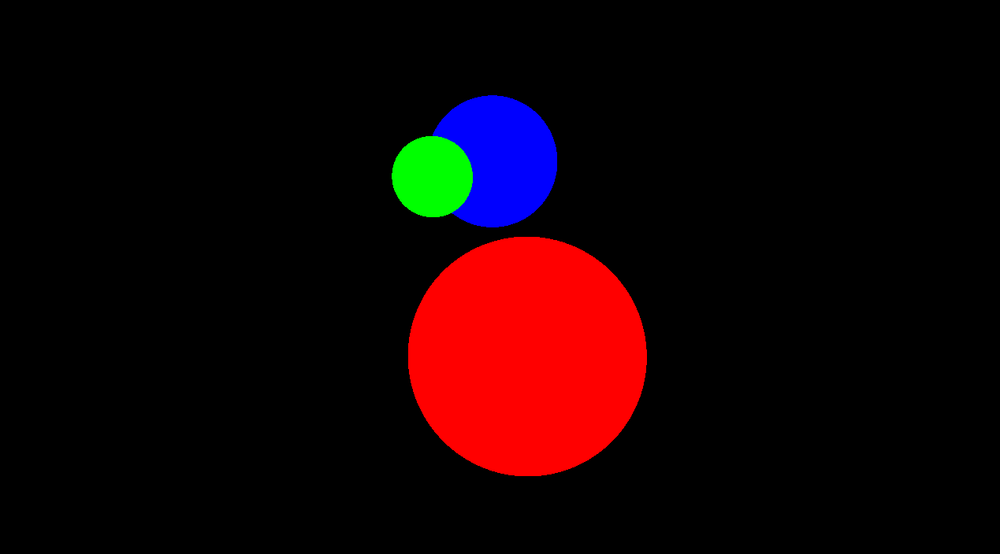

# osen-raytracer

An OpenGl-based Raytracer, with Disney's principled BRDF diffuse.



## Features

- Primitive:
    - Triangle
- Material:
    - Diffuse maps
    - Roughness maps
    - Normal maps

## Build

```bash
git clone https://github.com/IndaPlus24/osen-raytracer.git
cd osen-raytracer
make
```

### Dependencies

- `mold`
- `clang`
- `GLFW3`
- `GLM`

## Run

```bash
./bin/main
```
