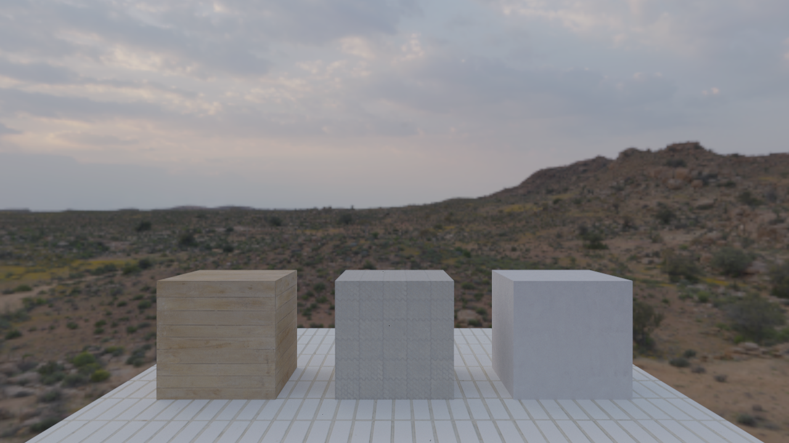

# Lumo

An OpenGl-based Raytracer, with Disney's principled BRDF diffuse.


## Features

- OBJ scene loading
- Material system:
    - Diffuse maps
    - Roughness maps
    - Normal maps
- HDRI lighting
- Toml-based scene descriptor

## Run

```bash
./build/bin/Lumo <path to scene file>
```

For example scene, use:

```bash
make run
```

## Scene descriptor

```toml
width = 1280                    # Image resolution
height = 720                    #
gamma = 2.2                     # Gamma
bounces = 10                    # Ray bounces
samples = 75                    # Rays per pixel
output_path = "./preview.png"   # Save path, press Enter to save result

[Camera]
fov = 45.0                              # FOV of camera
pos = { x = 0.0, y = 3.0, z = -10.0 }   # Camera position

[Enviroment]
path = "res/textures/klippad_dawn_2_2k.exr" # Path to HDRI for enviroment lighting, use EXR-files

[Mesh]
path = "res/models/scene-2.obj" # Path to .obj mesh-file

[Materials]
# Material names, order dictates MaterialID index
order = ["Plaster", "Tiles", "Concrete", "Planks"]

[Materials.Planks] # Material Name
# path: path to texture
# format: texture format, e.g; RGB8(RGB), RGBA8(Alpha) or R8(Grayscale)
diffuse = { path = "res/textures/wood_planks_diff_2k.png", format = "RGB8" }
roughness = { path = "res/textures/wood_planks_rough_2k.png", format = "R8" }
normal = { path = "res/textures/wood_planks_nor_gl_2k.png", format = "RGB8" }

[Materials.Tiles]
diffuse = { path = "res/textures/long_white_tiles_diff_2k.png", format = "RGB8" }
roughness = { path = "res/textures/long_white_tiles_rough_2k.png", format = "R8" }
normal = { path = "res/textures/long_white_tiles_nor_gl_2k.png", format = "RGB8" }

[Materials.Plaster]
diffuse = { path = "res/textures/painted_plaster_wall_diff_2k.png", format = "RGB8" }
roughness = { path = "res/textures/painted_plaster_wall_rough_2k.png", format = "R8" }
normal = { path = "res/textures/painted_plaster_wall_nor_gl_2k.png", format = "RGB8" }

[Materials.Concrete]
diffuse = { path = "res/textures/patterned_concrete_pavers_diff_2k.png", format = "RGB8" }
roughness = { path = "res/textures/patterned_concrete_pavers_rough_2k.png", format = "R8" }
normal = { path = "res/textures/patterned_concrete_pavers_nor_gl_2k.png", format = "RGB8" }
```

## Build

```bash
git clone git@github.com:TXTstyle/lumo.git
cd lumo
make
```

### Dependencies

- `CMake`
- `GLFW3`
- `GLM`
- `OpenEXR`
    - `Imath`

<details>
<summary>Arch</summary>

```bash
sudo pacman -S cmake glfw glm openexr imath
```

</details>


# Previews

## HDRI


## Materials


