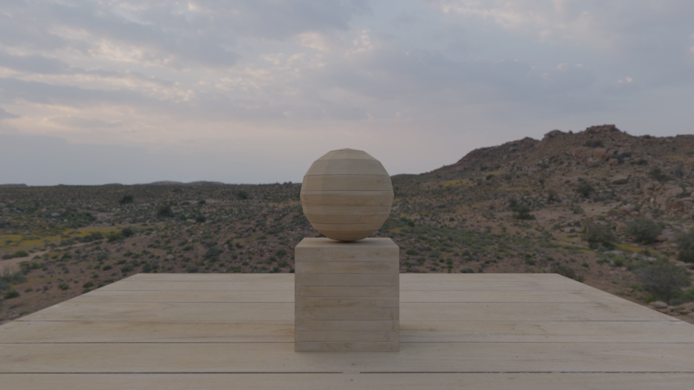

# osen-raytracer

An OpenGl-based Raytracer, with Disney's principled BRDF diffuse.


## Features

- OBJ scene loading
- Material system:
    - Diffuse maps
    - Roughness maps
    - Normal maps
- HDRI lighting

## Build

```bash
git clone git@github.com:IndaPlus24/osen-raytracer.git
cd osen-raytracer
make
```

### Dependencies

- `mold`
- `clang`
- `GLFW3`
- `GLM`
- `OpenEXR`
    - `Imath`

<details>
    <summary>Arch</summary>

    ```bash
    sudo pacman -S mold clang glfw glm openexr imath
    ```
</details>

## Run

```bash
./build/bin/Geisli
```

Or 

```bash
make run
```

# Previews

## HDRI


